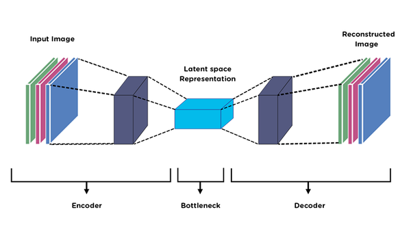
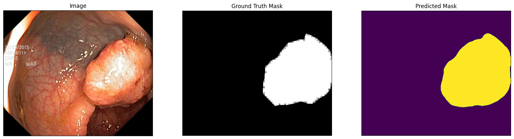

# Gastrointestinal Polyp Segmentation Using Encoder-Decoder Networks

This project applies image segmentation techniques to identify and delineate polyps from gastrointestinal tract images using deep learning models. We experiment with various encoder-decoder architectures like UNet, UNet++, DeepLabV3Plus, and PSPNet, employing MobileNetV2 and ResNet50 as encoders. The goal is to achieve high accuracy in polyp segmentation, as polyps are precursors to colorectal cancer.

## Table of Contents

- [Project Overview](#project-overview)
- [Dataset](#dataset)
- [Models Implemented](#models-implemented)
- [How to Run](#how-to-run)
- [Results](#results)
- [References](#references)

## Project Overview

Colorectal cancer is a leading cause of cancer-related deaths. Early detection and removal of polyps can help prevent it. In this project, we leverage convolutional neural networks (CNNs) with advanced encoder-decoder architectures to improve polyp segmentation accuracy. The models are trained and evaluated on the **Kvasir-SEG** dataset, which contains 1000 polyp images and corresponding masks. We experiment with different models, fine-tuning them to maximize performance, and combining them to achieve state-of-the-art results.

## Dataset

- **Name**: Kvasir-SEG
- **Size**: 46.2 MB
- **Content**: 1000 polyp images with corresponding ground truth masks
- **Resolution**: Varies from 332x487 to 1920x1072 pixels
- **Format**: JPEG for images and JSON for bounding box coordinates
- **Link**: [Kvasir-SEG Dataset](https://datasets.simula.no/kvasir-seg/)

## Models Implemented

<p align="center">
  <a href="https://gitpoint.co/">
    
  </a>
</p>

We implemented and experimented with the following models:

1. **UNet** with ResNet50 and MobileNetV2 encoders
2. **UNet++** with ResNet50 and MobileNetV2 encoders
3. **PSPNet** with ResNet50 and MobileNetV2 encoders
4. **DeepLabV3Plus** with ResNet50 and MobileNetV2 encoders

Transfer learning was utilized to accelerate model training by leveraging pre-trained weights from the ImageNet dataset.

## How to Run

1. Clone the repository:
   ```bash
   git clone https://github.com/MohaZamani/Gastrointestinal-Polyp-Segmentation.git
   ```
2. Install the necessary dependencies:
   ```bash
   pip install -r requirements.txt
   ```
3. Run the Jupyter notebook:
   ```bash
   jupyter notebook
   ```
4. Open and run `main.ipynb` to train and evaluate the models on the Kvasir-SEG dataset. Follow the steps inside the notebook to preprocess the data, train the models, and visualize the results.

## Results

The models were evaluated using the following metrics:

- **Dice Score**: Measures the overlap between the predicted segmentation and the ground truth.
- **IOU (Intersection over Union)**: Measures how well the predicted segments match the ground truth.
- **Dice Loss**: Used as a loss function, complementary to the Dice Score.

### Performance Results:

- **UNet with ResNet50**: IoU = 0.9261, Dice Score = 0.9163
- **UNet++ with ResNet50**: IoU = 0.9229, Dice Score = 0.9495
- **PSPNet with ResNet50**: IoU = 0.8652, Dice Score = 0.9187
- **DeepLabV3Plus with ResNet50**: IoU = 0.9064, Dice Score = 0.9316

<p align="center">
  <a href="https://gitpoint.co/">
    
  </a>
</p>

Visualizations of training and test performance can be found in the results section of the [report](./Report/Report.pdf).

## References

1. Galdran, A., Carneiro, G., & González Ballester, M. A. (2021). _Double Encoder-Decoder Networks for Gastrointestinal Polyp Segmentation_.
2. Ronneberger, O., Fischer, P., & Brox, T. (2015). _U-Net: Convolutional Networks for Biomedical Image Segmentation_.
3. Chen, L. C., Zhu, Y., Papandreou, G., Schroff, F., & Adam, H. (2018). _Encoder-Decoder with Atrous Separable Convolution for Semantic Image Segmentation_.
4. Zhao, H., Shi, J., Qi, X., Wang, X., & Jia, J. (2017). _Pyramid Scene Parsing Network_.
